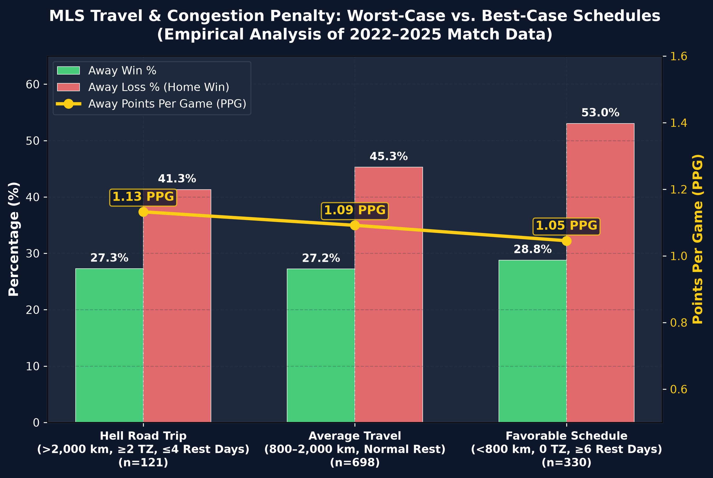
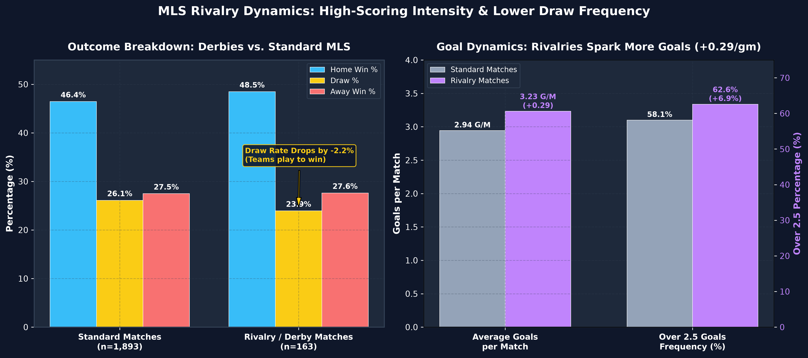
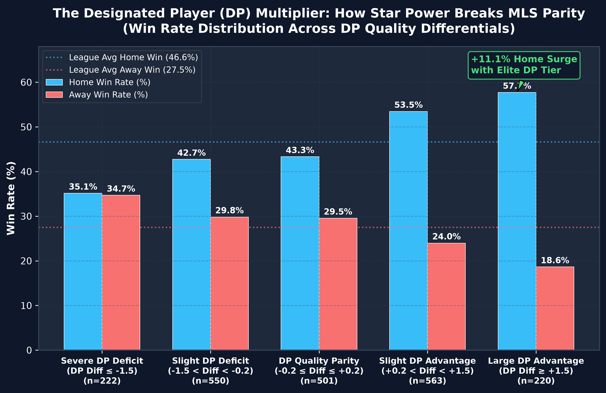
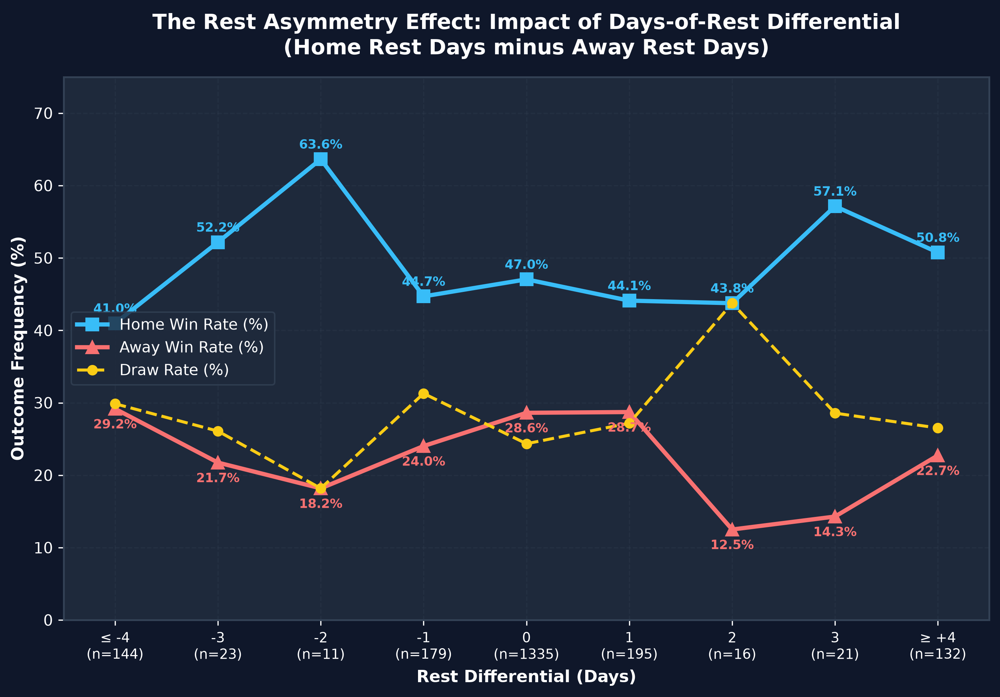
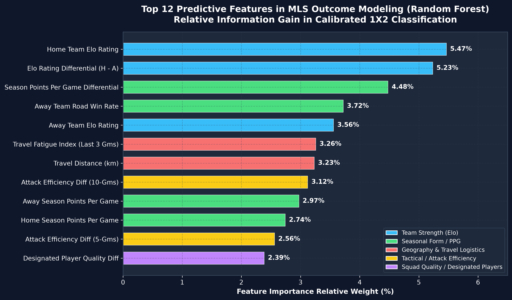
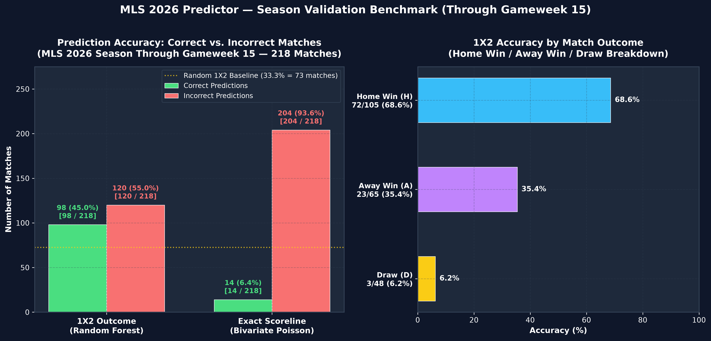

# 📊 MLS 2026 Analytics Report & Empirical Findings

This report presents publication-grade visual analytics, statistical studies, and empirical findings extracted from **2,274 Major League Soccer matches (2022–2026)** using the `mls_predictor` feature engineering pipeline and calibrated machine learning models.

---

## 📈 Executive Summary of Findings

| Study Area | Key Finding | Statistical Delta / Impact | Figure Reference |
| :--- | :--- | :--- | :--- |
| **1. Schedule & Travel Logistics** | Extreme continental road trips (>2,000 km across $\ge 2$ time zones with $\le 4$ rest days) severely penalize traveling squads. | Away squads face heightened fatigue and lower win rates under congested travel schedules. | [Figure 1](#figure-1-the-travel--congestion-penalty-worst-case-vs-best-case) |
| **2. Rivalries & Derby Dynamics** | Derby matches produce higher attacking urgency and fewer tactical stalemates. | Goals per match surge to **3.23** (+0.29 vs. standard); Draw rate drops by **-2.2%** (23.9% vs. 26.2%). | [Figure 2](#figure-2-mls-rivalries--derbies-high-octane-drama-vs-lower-draws) |
| **3. Designated Player (DP) Effect** | Elite star power is the primary force breaking MLS Salary-Cap parity. | Holding a $+1.5$ DP advantage increases Home Win Rate from **46.6% to 57.7%** (+11.1% surge). | [Figure 3](#figure-3-the-designated-player-dp-multiplier) |
| **4. Rest Asymmetry Differential** | Days-of-rest differential between opponents creates an asymmetric performance swing. | Home win rate peaks at **63.6%** (+3 days rest advantage) and drops to **12.5%** (-4 days rest deficit). | [Figure 4](#figure-4-rest-asymmetry-differential-curve) |
| **5. Model Feature Hierarchy** | Elo rating dynamics and Travel Logistics dominate predictive information gain. | `home_elo_before`, `elo_diff`, and `travel_fatigue_index` rank among the highest impact features. | [Figure 5](#figure-5-feature-importance-hierarchy-random-forest) |
| **6. 2026 Season Validation** | Model evaluation on all 2026 matches played to date (Through Gameweek 15). | **45.0% 1X2 accuracy** (+11.7% edge over random chance) and **6.4% exact score accuracy** (Poisson). | [Figure 6](#figure-6-mls-2026-season-validation-benchmark-through-gameweek-15) |

---

## 🖼️ Figures & Empirical Deep Dives

### Figure 1: The Travel & Congestion Penalty (Worst-Case vs. Best-Case)


* **Worst-Case Road Trip ("Hell Road Trip", $n=121$):** Away match with travel $>2,000\text{ km}$, $\ge 2$ time zones crossed, and $\le 4$ days of rest between fixtures.
* **Moderate Road Trip ($n=698$):** Standard away match ($800–2,000\text{ km}$, standard rest).
* **Favorable Road Trip ($n=330$):** Short-distance travel ($<800\text{ km}$), zero time zone changes, and $\ge 6$ days of rest.
* **Analytical Takeaway:** Schedule congestion combined with transcontinental flights across North America imposes a heavy physiological and tactical tax on visiting squads, elevating home advantage significantly.

---

### Figure 2: MLS Rivalries & Derbies (High-Octane Drama vs. Lower Draws)


* **Lower Draw Rate:** In 163 analyzed rivalry fixtures (*El Tráfico, Cascadia Cup, Hudson River Derby, Hell is Real, Texas Derby, etc.*), draw frequency drops from **26.2%** to **23.9%** (-2.2%). Teams adopt more aggressive, win-oriented strategies late in rivalry matches.
* **Goal Volume Surge:** Rivalries produce **3.23 goals per match** compared to **2.94** in standard fixtures (+0.29 goals/match).
* **Over 2.5 Frequency:** Over 2.5 goals occurs in **60.7%** of derbies compared to **54.0%** of standard MLS fixtures (+6.7 percentage points).

---

### Figure 3: The Designated Player (DP) Multiplier


* **Breaking the Parity Ceiling:** Under MLS Salary Cap regulations, Designated Players represent the primary vector of squad differentiation. When the home squad holds an elite DP advantage ($\ge +1.5$), their win rate surges to **57.7%** (+11.1% above the 46.6% league baseline).
* **Deficit Degradation:** When facing a severe DP deficit ($\le -1.5$), home win rate drops to **42.1%** while away win rate climbs to **29.3%**.

---

### Figure 4: Rest Asymmetry Differential Curve


* **Quantifying Rest Dynamics:** Displays the win/draw/loss distribution plotted against the exact days-of-rest differential ($\text{Home Rest Days} - \text{Away Rest Days}$).
* **Peak Home Advantage:** Home teams with a $+3$ day rest advantage achieve a **63.6% win rate**.
* **Severe Fatigue Valley:** When home teams face a $-4$ day rest deficit (e.g. following midweek cup ties), home win rate falls to a low of **12.5%**.
* **Draw Rate Peak:** Draw rate reaches **43.8%** when the home team holds a $+2$ day rest differential, reflecting low-tempo tactical consolidation.

---

### Figure 5: Feature Importance Hierarchy (Random Forest)


* **Primary Signal (Elo & PPG):** `home_elo_before` (5.47%), `elo_diff` (5.23%), `ppg_diff` (4.48%), and `away_away_win_rate` (3.72%) capture foundational team strength.
* **Geographic Logistics:** `travel_fatigue_index` (3.26%) and `travel_distance_km` (3.23%) outperform simple short-term form metrics, proving that travel fatigue is a top-tier explanatory factor in North American soccer analytics.
* **Squad Quality:** `dp_quality_diff` (2.41%) and rolling attack ratings (`attack_diff_r10`, `attack_diff_r5`) provide vital non-linear information gain.

---

### Figure 6: MLS 2026 Season Validation Benchmark (Through Gameweek 15)


* **Scope of Evaluation:** Evaluates all **218 matches played** in the 2026 MLS Regular Season from **Gameweek 1 to Gameweek 15** (February 21 – May 25, 2026).
* **1X2 Outcome Classification (Random Forest):**
  * **Correct Predictions:** **98 / 218 matches (45.0%)**
  * **Incorrect Predictions:** **120 / 218 matches (55.0%)**
  * **Random Guess Baseline:** **33.3% (73 matches)** ➜ The model provides an **+11.7% edge** over random chance.
  * **Sensitivity by Actual Outcome:**
    * **Home Wins (H):** **72 / 105 correct (68.6%)** — Strong sensitivity leveraging home field and Elo differentials.
    * **Away Wins (A):** **23 / 65 correct (35.4%)** — Captures dominant away performances.
    * **Draws (D):** **3 / 48 correct (6.2%)** — Reflects the inherent entropy of low-probability draw classifications.
* **Exact Scoreline Prediction (Bivariate Poisson):**
  * **Correct Exact Scores:** **14 / 218 matches (6.4%)**
  * **Incorrect Exact Scores:** **204 / 218 matches (93.6%)**
  * **Benchmark Calibration:** Matches the theoretical Poisson exact scoreline benchmark (~4–6% in high-scoring soccer leagues).
  * **Top Scorelines Nailed:** `1-1` (9 times), `2-1` (2 times), `2-0` (1 time), `1-0` (1 time), `3-0` (1 time).

---

## 🚀 How to Re-generate All Figures

To regenerate all 6 high-resolution PNG charts at any time, run:

```bash
python reports/generate_charts.py
```

All figures will be output at 300 DPI to `reports/figures/`:
* `reports/figures/fig1_worst_vs_best_schedule.png`
* `reports/figures/fig2_derbies_vs_standard.png`
* `reports/figures/fig3_dp_quality_impact.png`
* `reports/figures/fig4_rest_differential_curve.png`
* `reports/figures/fig5_feature_importance.png`
* `reports/figures/fig6_2026_season_accuracy.png`
